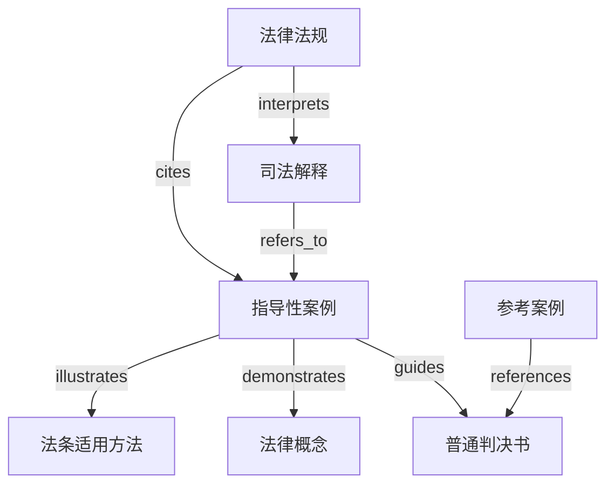

# 指导性案例与参考案例配置补充说明

## 📌 更新说明

本文档是对《法律统一知识图谱配置说明.md》的重要补充，详细说明了**指导性案例**和**参考案例**作为第四、第五文档源的配置方案。

**更新日期**：2025-12-30  
**更新版本**：v1.1（指导性案例增强版）

---

## 🎯 为什么需要增加指导性案例和参考案例？

### 1. 中国司法实践的特殊性

虽然中国不是判例法国家，但最高人民法院发布的**指导性案例**在司法实践中具有重要地位：

#### 指导性案例的特点
- ✅ **准约束力**：虽非正式法律渊源，但各级法院审理类似案件时"应当参照"
- ✅ **权威性**：由最高人民法院审判委员会讨论通过并发布
- ✅ **示范性**：展示特定法律条文在具体案件中的适用方法
- ✅ **编号体系**：有统一的编号（如"指导案例123号"）
- ✅ **覆盖领域广**：涵盖刑事、民事、行政、知识产权等各领域

#### 参考案例的特点
- 📚 **参考价值**：如最高法公报案例、典型案例，具有参考意义但无约束力
- 📚 **教学意义**：常用于法学教育和司法培训
- 📚 **类型丰富**：包括公报案例、年度案例、专题案例等

### 2. 在知识图谱中的重要性



指导性案例和参考案例在知识图谱中起到**桥梁作用**：
- 连接抽象的法律规范与具体的司法实践
- 为法条适用提供权威示范
- 形成"法律→解释→指导案例→判决"的完整链条

---

## 🔧 配置更新内容

### 一、新增实体类型（2种文档类型 + 2种标识类型）

#### 1. 文档类型实体
```yaml
- GUIDING_CASE: 指导性案例
  描述：最高人民法院发布的具有指导意义和准约束力的案例
  示例：指导案例123号 关于××的指导性案例
  
- REFERENCE_CASE: 参考案例
  描述：最高人民法院公报案例、典型案例等，具有参考价值但无约束力
  示例：最高人民法院公报2023年第2期案例
```

#### 2. 标识实体类型
```yaml
- GUIDING_CASE_NUMBER: 指导性案例编号
  格式：指导案例[数字]号
  示例：指导案例123号
  
- REFERENCE_CASE_NUMBER: 参考案例编号
  格式：根据具体案例来源而定
  示例：公报2023年第2期案例、2023年度十大典型案例之一
```

### 二、新增关系类型（6种核心关系）

#### 1. guides（指导关系）⭐ **最重要**
```yaml
定义：[GUIDING_CASE] -> [JUDGMENT]
含义：指导性案例指导普通判决书
强度：9分（体现准约束力，仅次于直接从属关系）

示例：
{
  "source": "指导案例123号",
  "target": "(2023)京01刑初456号判决书",
  "description": "本判决参照指导案例123号认定正当防卫",
  "strength": 9
}
```

**识别标志**：
- 判决书中出现"根据指导案例XX号"
- "参照指导案例XX号的精神"
- "本案情形与指导案例XX号类似"

#### 2. references（参考关系）
```yaml
定义：[JUDGMENT/GUIDING_CASE] -> [REFERENCE_CASE]
含义：判决书或指导性案例参考了参考案例
强度：7分（明确但非直接关系）

示例：
{
  "source": "(2023)京01民初789号判决书",
  "target": "最高法公报2022年第5期案例",
  "description": "本判决参考了公报案例的裁判思路",
  "strength": 7
}
```

#### 3. published_by（发布关系）
```yaml
定义：[GUIDING_CASE/REFERENCE_CASE] -> [ISSUING_AUTHORITY]
含义：案例由最高法等机关发布
强度：10分（直接创造关系）

示例：
{
  "source": "指导案例123号",
  "target": "最高人民法院",
  "description": "由最高人民法院审判委员会讨论通过并发布",
  "strength": 10
}
```

#### 4. demonstrates（示范关系）
```yaml
定义：[GUIDING_CASE/REFERENCE_CASE] -> [LEGAL_CONCEPT]
含义：案例示范了某个法律概念的适用
强度：8分（紧密相关且互相影响）

示例：
{
  "source": "指导案例24号",
  "target": "正当防卫",
  "description": "该案例示范了正当防卫的认定标准和适用条件",
  "strength": 8
}
```

#### 5. illustrates（阐释关系）
```yaml
定义：[GUIDING_CASE/REFERENCE_CASE] -> [ARTICLE]
含义：案例阐释了法条的具体适用方法
强度：8分（紧密相关）

示例：
{
  "source": "指导案例24号",
  "target": "《刑法》第二十条",
  "description": "该案例阐释了刑法第二十条正当防卫条款的具体适用",
  "strength": 8
}
```

#### 6. based_on_guiding_case（基于指导关系）
```yaml
定义：[JUDGMENT] -> [GUIDING_CASE]
含义：判决明确基于指导性案例作出（强调指导作用）
强度：9分（比一般引用关系更强）

示例：
{
  "source": "(2023)京01刑初456号判决书",
  "target": "指导案例24号",
  "description": "本判决基于指导案例24号的裁判规则认定正当防卫",
  "strength": 9
}
```

**与 cited_by 的区别**：
- `based_on_guiding_case`：判决的核心裁判理由基于指导性案例
- `cited_by`：仅仅是引用关系，可能只是辅助性参考

### 三、关系类型对比表

| 关系类型 | 源实体 | 目标实体 | 强度 | 用途 | 关键词识别 |
|---------|--------|---------|------|------|-----------|
| guides | GUIDING_CASE | JUDGMENT | 9 | 指导性案例的准约束力 | "参照指导案例"、"根据指导案例" |
| references | JUDGMENT | REFERENCE_CASE | 7 | 参考案例的参考价值 | "参考"、"借鉴" |
| based_on_guiding_case | JUDGMENT | GUIDING_CASE | 9 | 强调基于指导案例作出判决 | "基于"、"依据指导案例" |
| cited_by | JUDGMENT | GUIDING_CASE | 7 | 一般性引用 | "引用"、"援引" |
| demonstrates | GUIDING_CASE | LEGAL_CONCEPT | 8 | 示范法律概念适用 | "示范"、"阐明" |
| illustrates | GUIDING_CASE | ARTICLE | 8 | 阐释法条适用方法 | "阐释"、"说明" |

---

## 📊 应用场景增强

### 场景1：从判决追溯指导性案例
```
用户查询：(2023)京01刑初456号判决参照了哪些指导性案例？

知识图谱查询路径：
(2023)京01刑初456号 --based_on_guiding_case--> 指导案例24号
指导案例24号 --demonstrates--> 正当防卫
指导案例24号 --illustrates--> 《刑法》第二十条
```

### 场景2：查找指导性案例指导的所有判决
```
用户查询：指导案例24号指导了哪些判决？

知识图谱查询路径：
指导案例24号 --guides--> [判决1, 判决2, 判决3, ...]
```

### 场景3：查找特定法律概念的指导性案例
```
用户查询：关于"正当防卫"的指导性案例有哪些？

知识图谱查询路径：
正当防卫 <--demonstrates-- [指导案例24号, 指导案例71号, ...]
```

### 场景4：查找法条的权威适用示范
```
用户查询：《刑法》第二十条有哪些权威的适用示范？

知识图谱查询路径：
《刑法》第二十条 <--illustrates-- 指导案例24号
《刑法》第二十条 <--applies-- [相关判决书]
```

### 场景5：构建完整的法律适用链条
```
用户查询：展示从法条到判决的完整适用路径

知识图谱查询路径：
《刑法》第二十条 (法条)
  └─> 指导案例24号 (illustrates)
       ├─> 正当防卫概念 (demonstrates)
       └─> (2023)京01刑初456号 (guides)
            └─> 张三无罪判决 (sentenced_to)
```

---

## 🔍 实体提取示例（指导性案例场景）

### 示例1：指导性案例文本
```
[输入]
文本：最高人民法院指导案例24号《荣宝英诉王阳、永诚财产保险股份有限公司江阴支公司机动车交通事故责任纠纷案》（2013年6月28日发布）

裁判要点：
1. 交通事故的受害人没有过错，其体质状况对损害后果的影响不属于可以减轻侵权人责任的法定情形。
2. 本案阐释了《侵权责任法》第二十六条的适用方法。

[输出]
[
  {"title": "指导案例24号", "type": "GUIDING_CASE_NUMBER", "description": "最高人民法院发布的指导性案例编号"},
  {"title": "荣宝英诉王阳、永诚财产保险股份有限公司江阴支公司机动车交通事故责任纠纷案", "type": "GUIDING_CASE", "description": "指导案例24号的案例名称"},
  {"title": "最高人民法院", "type": "ISSUING_AUTHORITY", "description": "发布指导性案例的机关"},
  {"title": "2013年6月28日", "type": "TIME", "description": "指导案例发布时间"},
  {"title": "荣宝英", "type": "PERSON", "description": "原告"},
  {"title": "王阳", "type": "PERSON", "description": "被告"},
  {"title": "永诚财产保险股份有限公司江阴支公司", "type": "ORG", "description": "被告"},
  {"title": "机动车交通事故责任纠纷", "type": "CAUSE_OF_ACTION", "description": "案由"},
  {"title": "《侵权责任法》", "type": "LAW", "description": "本案适用的法律"},
  {"title": "第二十六条", "type": "ARTICLE", "description": "侵权责任法第二十六条"},
  {"title": "受害人过错与责任减轻", "type": "LEGAL_CONCEPT", "description": "本案示范的法律概念"}
]
```

### 示例2：判决书引用指导性案例
```
[输入]
文本：北京市第一中级人民法院民事判决书 (2023)京01民初789号。本院认为，关于被告体质状况是否应当减轻赔偿责任的问题，根据最高人民法院指导案例24号的裁判要点，交通事故的受害人没有过错，其体质状况对损害后果的影响不属于可以减轻侵权人责任的法定情形。本案参照该指导案例，认定被告的体质状况不影响原告的赔偿责任。

[输出 - 实体]
[
  {"title": "(2023)京01民初789号", "type": "CASE_NUMBER", "description": "案号"},
  {"title": "北京市第一中级人民法院", "type": "COURT", "description": "审理法院"},
  {"title": "指导案例24号", "type": "GUIDING_CASE_NUMBER", "description": "本案参照的指导性案例"},
  {"title": "最高人民法院", "type": "ISSUING_AUTHORITY", "description": "发布指导案例的机关"}
]

[输出 - 关系]
[
  {
    "source": "(2023)京01民初789号",
    "target": "指导案例24号",
    "description": "本判决参照指导案例24号认定体质状况不影响赔偿责任",
    "strength": 9
  },
  {
    "source": "指导案例24号",
    "target": "(2023)京01民初789号",
    "description": "指导案例24号指导了本案的裁判",
    "strength": 9
  },
  {
    "source": "(2023)京01民初789号",
    "target": "北京市第一中级人民法院",
    "description": "本案由北京一中院审理",
    "strength": 10
  },
  {
    "source": "指导案例24号",
    "target": "最高人民法院",
    "description": "指导案例24号由最高法发布",
    "strength": 10
  }
]
```

---

## 💡 提示词优化要点

### 1. 识别指导性案例的关键特征
在实体提取提示词中增加以下识别规则：

```markdown
### 指导性案例识别规则：
1. **编号识别**：
   - 出现"指导案例[数字]号"、"指导性案例[数字]号"
   - 提取为 GUIDING_CASE_NUMBER 类型
   
2. **发布机关**：
   - 通常由"最高人民法院"发布
   - 经"最高人民法院审判委员会"讨论通过
   
3. **结构特征**：
   - 包含"裁判要点"部分
   - 通常有案例名称（当事人姓名 + 案由）
   - 发布时间明确
   
4. **标识词**：
   - "参照本指导案例"
   - "应当参照"
   - "指导案例确立的裁判规则"
```

### 2. 关系提取时的优先级
```markdown
### 指导性案例关系提取优先级：
1. **最高优先级**：guides 和 based_on_guiding_case
   - 当判决书明确提到"参照指导案例"时，必须建立这两个关系
   
2. **次优先级**：demonstrates 和 illustrates
   - 指导案例与法律概念、法条之间的关系
   
3. **基础关系**：published_by
   - 指导案例与发布机关的关系
```

### 3. 关系强度评分指南（针对指导性案例）
```markdown
- 10分：直接从属（published_by, adjudicated_by）
- 9分：指导关系（guides, based_on_guiding_case）
- 8分：示范/阐释（demonstrates, illustrates）
- 7分：参考关系（references）
- 6分：一般引用（cited_by）
```

---

## 📈 统计意义

将指导性案例纳入知识图谱后，可以进行以下统计分析：

### 1. 指导性案例使用频率分析
```sql
-- 查询被引用最多的指导性案例
SELECT guiding_case, COUNT(*) as citation_count
FROM guides_relations
GROUP BY guiding_case
ORDER BY citation_count DESC
LIMIT 10;
```

### 2. 法律概念的权威示范来源
```sql
-- 查询特定法律概念的所有指导性案例
SELECT legal_concept, guiding_case
FROM demonstrates_relations
WHERE legal_concept = '正当防卫';
```

### 3. 地域差异分析
```sql
-- 分析不同地区法院对指导性案例的参照情况
SELECT court_region, COUNT(*) as reference_count
FROM judgments j
JOIN guides_relations g ON j.case_number = g.judgment
GROUP BY court_region;
```

---

## 🚀 实施建议

### 阶段1：基础数据收集（1-2周）
- [ ] 收集最高法已发布的所有指导性案例（截至2025年约200+例）
- [ ] 整理指导性案例的编号、名称、发布时间、裁判要点
- [ ] 收集常见的参考案例来源（公报案例、年度案例等）

### 阶段2：实体提取（2-3周）
- [ ] 对指导性案例进行实体和关系提取
- [ ] 建立指导性案例与法条、法律概念的关联
- [ ] 验证提取质量

### 阶段3：关系建立（3-4周）
- [ ] 从现有判决书中识别对指导性案例的引用
- [ ] 建立 guides 和 based_on_guiding_case 关系
- [ ] 建立 demonstrates 和 illustrates 关系

### 阶段4：验证与优化（1-2周）
- [ ] 验证关系的准确性
- [ ] 优化提示词以提高识别准确率
- [ ] 建立质量监控机制

---

## ❓ 常见问题

### Q1: 如何区分指导性案例和参考案例？
**A**: 
- **指导性案例**：有明确编号（指导案例XX号），由最高法审判委员会讨论通过，各级法院"应当参照"
- **参考案例**：包括公报案例、典型案例等，仅具有参考价值，法院可以选择性参考

### Q2: guides 和 based_on_guiding_case 有什么区别？
**A**:
- **guides**: 从指导性案例角度出发，表示"指导案例 → 判决"的指导关系
- **based_on_guiding_case**: 从判决角度出发，表示"判决 → 指导案例"的依据关系
- 两者是同一关系的不同视角，在知识图谱中应同时建立（双向关系）

### Q3: 如何处理判决书"参考"和"参照"的区别？
**A**:
- **参照**（指导性案例）：使用 `based_on_guiding_case` 关系，强度9分
- **参考**（参考案例）：使用 `references` 关系，强度7分

### Q4: 指导性案例的效力如何在知识图谱中体现？
**A**: 通过关系强度体现：
- guides 关系的强度设为 9 分（仅次于直接从属关系的10分）
- 这体现了指导性案例的准约束力，高于一般参考案例（7分）但低于正式法律渊源

### Q5: 如何保证指导性案例编号的唯一性？
**A**: 
1. 使用标准格式："指导案例[数字]号"
2. 建立编号映射表，处理不同表述方式（如"指导性案例123号"→"指导案例123号"）
3. 在实体消歧时优先匹配编号

---

## 📚 参考资料

1. 《最高人民法院关于案例指导工作的规定》（法发〔2010〕51号）
2. 《最高人民法院关于案例指导工作的规定实施细则》（法〔2015〕130号）
3. 最高人民法院指导性案例库（https://www.court.gov.cn/）
4. 《人民法院案例选》（最高人民法院出版）

---

## 🔄 版本历史

| 版本 | 日期 | 更新内容 |
|------|------|----------|
| v1.1 | 2025-12-30 | 新增指导性案例和参考案例支持 |
| v1.0 | 2025-12-30 | 初始版本（三大文档源） |

---

**最后更新时间**: 2025-12-30  
**文档版本**: v1.1  
**配置版本**: WeKnora统一知识图谱版（指导性案例增强版）
