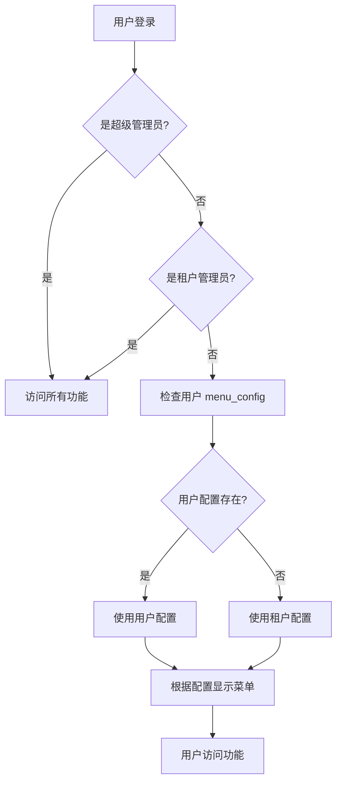

# WeKnora 权限管理系统

## 📋 概述

WeKnora 采用基于用户的分层权限管理系统，支持超级管理员、租户管理员和普通用户三种角色，提供灵活的菜单权限配置能力。

## 🏗️ 权限架构

### 架构设计

权限系统采用**用户级别 + 租户级别**的混合设计：

```
用户权限 = 用户.menu_config (优先) || 租户.menu_config (兜底) || ["creatChat"] (默认)
```

| 层级 | 作用 | 优先级 | 适用场景 |
|------|------|--------|----------|
| **用户级别** | 为每个用户单独配置权限 | ⭐⭐⭐ 最高 | 个性化权限定制 |
| **租户级别** | 作为默认配置模板（兜底） | ⭐⭐ 次之 | 统一的默认权限 |
| **角色级别** | 超级管理员和租户管理员绕过配置检查 | ⭐ 基础 | 管理员全功能访问 |

### 数据模型

#### User 表结构

```go
type User struct {
    ID                  string         `json:"id"`
    Username            string         `json:"username"`
    Email               string         `json:"email"`
    TenantID            uint64         `json:"tenant_id"`
    Role                UserRole       `json:"role"`               // "admin" 或 "user"
    CanAccessAllTenants bool           `json:"can_access_all_tenants"` // 超级管理员标识
    MenuConfig          UserMenuConfig `json:"menu_config"`        // 用户级别权限配置
    IsActive            bool           `json:"is_active"`
    CreatedAt           time.Time      `json:"created_at"`
    UpdatedAt           time.Time      `json:"updated_at"`
}

type UserMenuConfig []string
```

#### Tenant 表结构

```go
type Tenant struct {
    ID          uint64     `json:"id"`
    Name        string     `json:"name"`
    MenuConfig  MenuConfig `json:"menu_config"` // 租户级别权限配置（作为默认模板）
    // ... 其他字段
}

type MenuConfig []string
```

## 👥 用户角色

### 1. 超级管理员 (Super Admin)

**识别条件：** `can_access_all_tenants = true`

**权限范围：**
- ✅ 访问所有功能（不受 menu_config 限制）
- ✅ 管理所有租户
- ✅ 跨租户操作
- ✅ 系统级别配置

**使用场景：** 系统部署和维护人员

### 2. 租户管理员 (Tenant Admin)

**识别条件：** `role = "admin"` 且 `can_access_all_tenants = false`

**权限范围：**
- ✅ 访问所有功能（不受 menu_config 限制）
- ✅ 管理本租户内的用户
- ✅ 配置租户设置
- ✅ 管理知识库和对话
- ✅ 查看审计日志（需租户 menu_config 配置）
- ❌ 无法访问其他租户

**使用场景：** 企业内部管理员、团队负责人

### 3. 普通用户 (Normal User)

**识别条件：** `role = "user"`

**权限范围：**
- 📋 根据 `menu_config` 配置决定可访问的功能
- 默认只能访问 "AI对话" 功能
- 需要租户管理员授权才能访问其他功能

**使用场景：** 一般员工、普通使用者

## 🎯 可配置的功能权限

### 功能权限列表

| 权限标识 | 功能名称 | 说明 |
|---------|---------|------|
| `creatChat` | AI对话 | 创建对话、使用 Agent 模式、普通对话 |
| `knowledge-bases` | 知识库管理 | 创建、编辑、删除知识库，上传文档 |
| `settings` | 系统设置 | 模型配置、对话策略、Web搜索、MCP工具 |
| `admin/dashboard` | 系统仪表盘 | 查看系统统计信息（仅管理员） |
| `admin/users` | 用户管理 | 管理租户内用户（仅租户管理员） |
| `admin/audit-logs` | 审计日志 | 查看操作日志（仅租户管理员） |
| `admin/tenants` | 租户管理 | 管理所有租户（仅超级管理员） |

### 默认权限配置

| 角色 | 默认权限 |
|-----|---------|
| 超级管理员 | 所有功能（不受限制） |
| 租户管理员 | 所有功能（不受限制） |
| 新注册普通用户 | `["creatChat"]` |
| 未配置的普通用户 | 继承租户 menu_config |

## 🔧 权限配置方法

### 方法一：通过数据库直接修改

#### 1. 修改用户权限

```sql
-- 给用户添加知识库管理权限
UPDATE users 
SET menu_config = '["creatChat", "knowledge-bases"]'::json
WHERE email = 'user@example.com';

-- 给用户添加全部功能权限
UPDATE users 
SET menu_config = '["creatChat", "knowledge-bases", "settings"]'::json
WHERE email = 'user@example.com';

-- 清空用户配置，使其继承租户配置
UPDATE users 
SET menu_config = '[]'::json
WHERE email = 'user@example.com';
```

#### 2. 修改租户默认权限

```sql
-- 设置租户默认只允许 AI对话
UPDATE tenants 
SET menu_config = '["creatChat"]'::json
WHERE id = 10000;

-- 设置租户默认允许对话和知识库
UPDATE tenants 
SET menu_config = '["creatChat", "knowledge-bases"]'::json
WHERE id = 10000;
```

### 方法二：通过 API 管理（待开发）

未来版本将提供用户管理界面，租户管理员可以通过前端界面直接修改用户权限。

## 📊 权限判断流程



### 前端权限检查逻辑

```typescript
// frontend/src/stores/menu.ts
const setMenuConfig = (allowedPaths: string[], isSuperAdmin: boolean, role?: string) => {
  const filtered = allMenus.filter(item => {
    if (item.path === 'logout') return true
    
    // 租户管理仅限超级管理员
    if (item.path === 'admin/tenants') return isSuperAdmin
    
    // 系统仪表盘允许超级管理员或租户管理员
    if (item.path === 'admin/dashboard') return isSuperAdmin || role === 'admin'
    
    // 用户管理和审计日志
    if (item.path === 'admin/users' || item.path === 'admin/audit-logs') {
      if (isSuperAdmin) return true
      if (role === 'admin') return allowedPaths.includes(item.path)
      return false
    }
    
    // 其他菜单：超级管理员和租户管理员可见所有功能
    if (isSuperAdmin || role === 'admin') return true
    
    // 普通用户：严格按照配置控制访问权限
    if (allowedPaths.length === 0) {
      return item.path === 'creatChat'  // 默认只允许 AI对话
    }
    return allowedPaths.includes(item.path)
  })
  // ...
}
```

### 后端权限检查示例

```go
// internal/handler/knowledgebase.go
func (h *KnowledgeBaseHandler) checkAdmin(c *gin.Context) bool {
    ctx := c.Request.Context()
    user, err := h.userService.GetCurrentUser(ctx)
    if err != nil {
        c.Error(errors.NewUnauthorizedError("Unauthorized"))
        return false
    }
    // 超级管理员或租户管理员可以访问
    if !user.CanAccessAllTenants && user.Role != types.RoleAdmin {
        c.Error(errors.NewForbiddenError("Insufficient permissions"))
        return false
    }
    return true
}
```

## 🚀 使用示例

### 场景1：企业内部使用

**需求：** 普通员工只能使用 AI对话功能，技术人员可以管理知识库

**配置方案：**

```sql
-- 租户默认配置：只允许对话
UPDATE tenants SET menu_config = '["creatChat"]'::json WHERE id = 10000;

-- 给技术人员添加知识库权限
UPDATE users 
SET menu_config = '["creatChat", "knowledge-bases"]'::json
WHERE email IN ('tech1@company.com', 'tech2@company.com');
```

### 场景2：部门独立管理

**需求：** 每个部门有自己的管理员，可以管理本部门的用户和知识库

**配置方案：**

```sql
-- 设置部门管理员角色
UPDATE users 
SET role = 'admin'
WHERE email IN ('dept1_admin@company.com', 'dept2_admin@company.com');

-- 租户配置允许管理员看到用户管理
UPDATE tenants 
SET menu_config = '["creatChat", "knowledge-bases", "settings", "admin/users"]'::json
WHERE id = 10000;
```

### 场景3：临时权限授予

**需求：** 临时给某个用户开放系统设置权限

**配置方案：**

```sql
-- 授予权限
UPDATE users 
SET menu_config = '["creatChat", "settings"]'::json
WHERE email = 'temp_user@company.com';

-- 权限使用完毕后撤回
UPDATE users 
SET menu_config = '["creatChat"]'::json
WHERE email = 'temp_user@company.com';
```

## 🔄 数据库迁移

### 迁移脚本

权限系统已包含数据库迁移脚本：

- **Up 脚本：** `migrations/versioned/000009_user_menu_config.up.sql`
- **Down 脚本：** `migrations/versioned/000009_user_menu_config.down.sql`

### 执行迁移

```bash
# 应用迁移
make migrate

# 或者
go run cmd/server/main.go migrate
```

### 迁移内容

```sql
-- 添加 menu_config 字段到 users 表
ALTER TABLE users ADD COLUMN IF NOT EXISTS menu_config JSON DEFAULT '[]';

-- 为现有普通用户设置默认权限
UPDATE users u
SET menu_config = COALESCE(
    (SELECT t.menu_config FROM tenants t WHERE t.id = u.tenant_id),
    '["creatChat"]'::json
)
WHERE u.role = 'user' 
  AND (u.menu_config IS NULL OR u.menu_config::text = '[]');
```

## 🛡️ 安全建议

### 1. 最小权限原则

- 默认给予用户最小必要权限
- 根据实际需要逐步授权
- 定期审查用户权限

### 2. 管理员账号安全

- 限制租户管理员数量
- 超级管理员账号应严格保密
- 启用强密码策略

### 3. 权限审计

- 定期检查用户权限配置
- 监控权限变更记录
- 及时回收离职员工权限

### 4. 租户隔离

- 确保租户间数据隔离
- 普通用户无法跨租户访问
- 谨慎授予跨租户访问权限

## 📝 开发指南

### 添加新的功能权限

#### 1. 定义权限标识

在前端 `menu.ts` 中添加新的菜单项：

```typescript
const allMenus: MenuItem[] = [
  // ... 现有菜单
  { title: '', titleKey: 'menu.newFeature', icon: 'icon-name', path: 'new-feature' }
]
```

#### 2. 更新权限检查逻辑

在 `setMenuConfig` 方法中添加权限判断：

```typescript
// 根据角色和配置决定是否显示
if (item.path === 'new-feature') {
  if (isSuperAdmin || role === 'admin') return true
  return allowedPaths.includes('new-feature')
}
```

#### 3. 后端API权限验证

在对应的 Handler 中添加权限检查：

```go
func (h *FeatureHandler) checkPermission(c *gin.Context) bool {
    ctx := c.Request.Context()
    user, err := h.userService.GetCurrentUser(ctx)
    if err != nil {
        c.Error(errors.NewUnauthorizedError("Unauthorized"))
        return false
    }
    
    // 管理员可以访问
    if user.CanAccessAllTenants || user.Role == types.RoleAdmin {
        return true
    }
    
    // 检查用户是否有该功能权限
    // 实现具体的权限检查逻辑
    return hasPermission(user, "new-feature")
}
```

## 🐛 故障排查

### 问题1：用户看不到任何菜单

**原因：** 用户 `menu_config` 和租户 `menu_config` 都为空

**解决方案：**

```sql
-- 检查用户配置
SELECT email, menu_config FROM users WHERE email = 'user@example.com';

-- 检查租户配置
SELECT id, name, menu_config FROM tenants WHERE id = (
    SELECT tenant_id FROM users WHERE email = 'user@example.com'
);

-- 设置默认权限
UPDATE users SET menu_config = '["creatChat"]'::json 
WHERE email = 'user@example.com';
```

### 问题2：管理员看不到管理功能

**原因：** 角色配置错误或权限检查逻辑问题

**解决方案：**

```sql
-- 检查用户角色
SELECT email, role, can_access_all_tenants FROM users 
WHERE email = 'admin@example.com';

-- 设置为租户管理员
UPDATE users SET role = 'admin' 
WHERE email = 'admin@example.com';
```

### 问题3：修改权限后不生效

**原因：** 前端缓存未更新

**解决方案：**
1. 清除浏览器缓存
2. 重新登录
3. 或清除 localStorage：`localStorage.clear()`

## 📚 相关文档

- [开发指南](./开发指南.md)
- [API 文档](./api/README.md)
- [用户管理 API](./api/user.md)
- [租户管理 API](./api/tenant.md)

## 🔄 版本历史

| 版本 | 日期 | 变更内容 |
|------|------|---------|
| v0.2.5+ | 2024-12-30 | 实现用户级别权限管理系统 |
| v0.2.0 | 2024-12 | 添加基本的角色管理功能 |

## 💬 反馈与支持

如有问题或建议，请通过以下方式联系我们：

- GitHub Issues: https://github.com/xiaotianhu999/IAGraphRAG/issues
- 官方网站: https://weknora.weixin.qq.com
