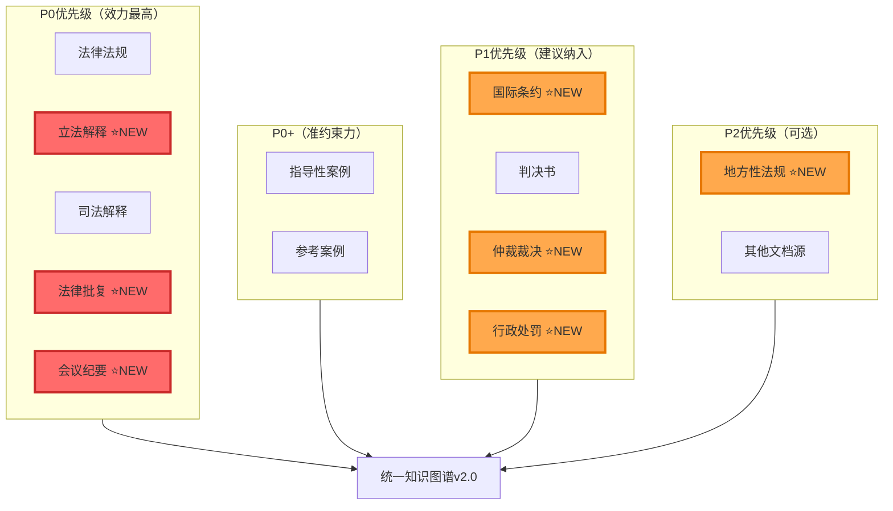

# 中国法律统一知识图谱 - 完整配置总结（v2.0）

## 📌 文档架构说明

本知识图谱配置包含以下文档：

1. **config.yaml** - 核心配置文件（位于 `config/config.yaml`）✅ 已更新至v2.0
2. **法律统一知识图谱配置说明.md** - 基础架构文档（位于 `docs/`）
3. **指导性案例与参考案例配置补充.md** - 指导性案例专项文档（位于 `docs/`）
4. **七大文档源扩展配置详解.md** - P0-P2级新增文档源详解（位于 `docs/`）⭐ 本次新增
5. **本文档** - 完整配置总结（v2.0完整12大文档源版）

---

## 🎯 知识图谱文档源体系（完整12大文档源）⭐ v2.0



| 文档源 | 实体类型 | 关键特征 | 法律效力 | 配置状态 | 版本 |
|--------|---------|---------|---------|---------|------|
| **法律法规** | LAW | 书名号，全国人大制定 | 正式法律渊源（最高） | ✅ 已配置 | v1.0 |
| **立法解释** ⭐ | LEGISLATIVE_INTERPRETATION | 全国人大常委会解释 | 与法律同等效力 | ✅ 已配置 | v2.0 |
| **司法解释** | JUDICIAL_INTERPRETATION | 最高法/最高检发布 | 准法律渊源 | ✅ 已配置 | v1.0 |
| **法律批复** ⭐ | JUDICIAL_REPLY | 批复、答复 | 应遵照执行 | ✅ 已配置 | v2.0 |
| **会议纪要** ⭐ | JUDICIAL_MEETING_MINUTES | 如九民纪要 | 统一审判尺度 | ✅ 已配置 | v2.0 |
| **指导性案例** | GUIDING_CASE | 指导案例编号 | 准约束力（应当参照） | ✅ 已配置 | v1.1 |
| **参考案例** | REFERENCE_CASE | 公报案例等 | 参考价值 | ✅ 已配置 | v1.1 |
| **国际条约** ⭐ | INTERNATIONAL_TREATY | 条约、公约 | 优先于国内法（除宪法） | ✅ 已配置 | v2.0 |
| **判决书** | JUDGMENT | 案号，各级法院 | 个案效力 | ✅ 已配置 | v1.0 |
| **仲裁裁决** ⭐ | ARBITRATION_AWARD | 仲裁案号 | 与判决同等效力 | ✅ 已配置 | v2.0 |
| **行政处罚** ⭐ | ADMINISTRATIVE_PENALTY | 处罚文号 | 行政约束力 | ✅ 已配置 | v2.0 |
| **地方性法规** ⭐ | LOCAL_REGULATION | 省市条例 | 地方有效 | ✅ 已配置 | v2.0 |

---

## 📊 实体类型体系（完整版 v2.0）⭐

### 一、文档类型实体（22种）- 扩展至12大文档源
```yaml
核心司法文书（6种）：
  - LEGAL_DOCUMENT: 法律文书统称
  - JUDGMENT: 判决书 ✅ v1.0
  - RULING: 裁定书 ✅ v1.0
  - MEDIATION: 调解书 ✅ v1.0
  - GUIDING_CASE: 指导性案例 ✅ v1.1
  - REFERENCE_CASE: 参考案例 ✅ v1.1

法律规范类（4种）：
  - LAW: 法律法规 ✅ v1.0
  - REGULATION: 行政法规/部门规章 ✅ v1.0
  - LOCAL_REGULATION: 地方性法规 ⭐ v2.0
  - INTERNATIONAL_TREATY: 国际条约 ⭐ v2.0

法律解释类（4种 - P0优先级）：
  - LEGISLATIVE_INTERPRETATION: 立法解释 ⭐ v2.0
  - JUDICIAL_INTERPRETATION: 司法解释 ✅ v1.0
  - JUDICIAL_REPLY: 法律批复/答复 ⭐ v2.0
  - JUDICIAL_MEETING_MINUTES: 会议纪要 ⭐ v2.0

争议解决类（2种）：
  - ARBITRATION_AWARD: 仲裁裁决书 ⭐ v2.0
  - LABOR_ARBITRATION_AWARD: 劳动仲裁裁决书 ⭐ v2.0

行政执法类（2种）：
  - ADMINISTRATIVE_PENALTY: 行政处罚决定书 ⭐ v2.0
  - ADMINISTRATIVE_RECONSIDERATION: 行政复议决定书 ⭐ v2.0

检察监督类（2种）：
  - PROCURATORIAL_SUGGESTION: 检察建议书 ⭐ v2.0
  - PROTEST: 抗诉书 ⭐ v2.0

辅助文档类（2种）：
  - NORMATIVE_DOCUMENT: 规范性文件 ✅ v1.0
  - JUDICIAL_APPRAISAL: 司法鉴定意见书 ⭐ v2.0
```

### 二、标识实体（8种）- 新增多种文档编号
```yaml
v1.0/v1.1（原有）：
- CASE_NUMBER: 案号（如 (2023)京01刑初123号）
- GUIDING_CASE_NUMBER: 指导性案例编号（如 指导案例123号）
- REFERENCE_CASE_NUMBER: 参考案例编号

v2.0（新增）：
- ARBITRATION_CASE_NUMBER: 仲裁案号 ⭐
- ADMINISTRATIVE_PENALTY_NUMBER: 行政处罚文号 ⭐
- LEGISLATIVE_INTERPRETATION_NUMBER: 立法解释编号 ⭐
- TREATY_NUMBER: 条约编号 ⭐
- ARTICLE: 法条
```

### 三、法律要素实体（10+种）
```yaml
- CRIME: 罪名
- CAUSE_OF_ACTION: 案由
- PUNISHMENT: 刑罚
- LIABILITY: 民事责任
- LEGAL_CONCEPT: 法律概念
- LEGAL_PRINCIPLE: 法律原则
- EVIDENCE: 证据
- EVIDENCE_TYPE: 证据种类
等...
```

### 四、参与主体实体（10+种）- 扩展仲裁和行政机构
```yaml
v1.0（原有）：
- PERSON: 自然人
- ORG: 机构组织
- COURT: 法院
- PROCURATORATE: 检察院
- LAWYER: 律师
- JUDGE: 法官

v2.0（新增）：
- ISSUING_AUTHORITY: 发文机关
- ARBITRATION_INSTITUTION: 仲裁机构 ⭐
- ADMINISTRATIVE_AGENCY: 行政机关 ⭐
- INTERNATIONAL_ORGANIZATION: 国际组织 ⭐
```

**总计**：50+ 实体类型（v1.1: 30+ → v2.0: 50+）

---

## 🔗 关系类型体系（完整版）

### 核心关系分类（9大类）

#### 1️⃣ 法规体系内关系（6种）
```yaml
- belongs_to: 法条属于法律
- part_of: 章节是组成部分
- amends: 修订关系
- repeals: 废止关系
- supersedes: 替代关系
- based_on: 基于上位法
```

#### 2️⃣ 司法解释关系（3种）
```yaml
- interprets: 解释法律
- clarifies: 澄清概念
- specifies: 细化法条
```

#### 3️⃣ 判决与法规关系（4种）
```yaml
- cites: 引用法条
- applies: 适用法条
- refers_to: 参照司法解释
- invokes: 援引法律原则
```

#### ⭐ 3-A. 指导性案例关系（6种）**【本次新增】**
```yaml
核心关系（最重要）：
- guides: 指导性案例指导判决 [强度: 9分]
- based_on_guiding_case: 判决基于指导案例 [强度: 9分]

辅助关系：
- references: 参考参考案例 [强度: 7分]
- published_by: 由最高法发布 [强度: 10分]
- demonstrates: 示范法律概念 [强度: 8分]
- illustrates: 阐释法条适用 [强度: 8分]
```

**关系强度说明**：
- **10分**：直接创造/从属（published_by, adjudicated_by）
- **9分**：指导关系（guides, based_on_guiding_case）⭐ 体现准约束力
- **8分**：示范/阐释（demonstrates, illustrates）
- **7分**：参考关系（references）
- **6分**：一般关联

#### 4️⃣ 案件实体关系（7种）
```yaml
- accused_of: 被指控罪名
- sued_for: 起诉案由
- sentenced_to: 判处刑罚
- bear_liability: 承担责任
- represents: 律师代理
- presides: 法官主审
- prosecutes: 检察院公诉
```

#### 5️⃣ 证据关系（3种）
```yaml
- proves: 证明事实
- supports: 支持判决
- contradicts: 证据矛盾
```

#### 6️⃣ 案件关联关系（4种）
```yaml
- similar_to: 类似案例
- cited_by: 被引用
- appeals_from: 上诉关系
- based_on_guiding_case: 基于指导案例 ⭐
```

#### 7️⃣ 概念关系（3种）
```yaml
- defines: 定义概念
- includes: 概念包含
- applies_concept: 涉及概念
```

#### 8️⃣ 组织文档关系（2种）
```yaml
- issued_by: 由机关发布
- adjudicated_by: 由法院审理
```

**总计**：40+ 关系类型

---

## 🎯 关键区分对照表

### 一、文档类型区分

| 对比维度 | 判决书 | 指导性案例 ⭐ | 参考案例 ⭐ | 法律法规 | 司法解释 |
|---------|-------|------------|-----------|---------|---------|
| **实体类型** | JUDGMENT | GUIDING_CASE | REFERENCE_CASE | LAW | JUDICIAL_INTERPRETATION |
| **唯一标识** | 案号 | 指导案例编号 | 公报案例编号 | 法律名称 | 解释名称 |
| **发布机关** | 各级法院 | 最高法 | 最高法 | 人大 | 最高法/最高检 |
| **法律效力** | 个案 | 应当参照 | 可参考 | 普遍约束 | 普遍约束 |
| **关系强度** | - | guides: 9分 | references: 7分 | - | - |

### 二、关系类型区分

| 关系 | 源 | 目标 | 含义 | 强度 | 使用场景 |
|-----|---|-----|------|------|---------|
| **guides** ⭐ | GUIDING_CASE | JUDGMENT | 指导判决 | 9 | 指导性案例指导作用 |
| **based_on_guiding_case** ⭐ | JUDGMENT | GUIDING_CASE | 基于指导案例 | 9 | 判决依据指导案例 |
| **references** ⭐ | JUDGMENT | REFERENCE_CASE | 参考案例 | 7 | 参考公报案例等 |
| **cited_by** | JUDGMENT | JUDGMENT | 引用判例 | 7 | 一般引用关系 |
| **cites** | JUDGMENT | LAW/ARTICLE | 引用法条 | 7 | 判决引用法律 |
| **applies** | JUDGMENT | ARTICLE | 适用法条 | 8 | 判决依据法条 |
| **demonstrates** ⭐ | GUIDING_CASE | LEGAL_CONCEPT | 示范概念 | 8 | 案例示范法律概念 |
| **illustrates** ⭐ | GUIDING_CASE | ARTICLE | 阐释法条 | 8 | 案例阐释法条适用 |

---

## 💡 提示词优化要点总结

### 一、实体提取提示词增强点

```markdown
1. 文档类型识别（新增指导性案例和参考案例识别）
   ✓ 判决书：案号识别
   ✓ 指导性案例：编号识别（指导案例XX号）⭐
   ✓ 参考案例：公报案例、典型案例等 ⭐
   ✓ 法律法规：书名号
   ✓ 司法解释：最高法/最高检发布

2. 标准化命名规则
   ✓ 法律：必须包含书名号
   ✓ 案号：必须完整
   ✓ 指导案例：统一格式"指导案例XX号" ⭐
   
3. 角色标注
   ✓ PERSON实体必须标注角色（被告、原告、证人等）
   
4. 元数据提取
   ✓ 发文机关、生效时间、效力层级
```

### 二、关系提取提示词增强点

```markdown
1. 跨文档关系优先
   ✓ 判决 → 法条（cites, applies）
   ✓ 指导案例 → 判决（guides）⭐ 最优先
   ✓ 判决 → 指导案例（based_on_guiding_case）⭐ 最优先
   ✓ 司法解释 → 法条（interprets）

2. 关系类型精确区分
   ✓ guides vs references（指导 vs 参考）⭐
   ✓ based_on_guiding_case vs cited_by（基于 vs 引用）⭐
   ✓ cites vs applies（引用 vs 适用）
   ✓ demonstrates vs illustrates（示范 vs 阐释）⭐

3. 识别关键词
   指导性案例关键词：
   - "参照指导案例"
   - "根据指导案例"
   - "应当参照"
   - "指导案例确立的规则"
```

---

## 📊 完整应用场景示例

### 场景1：从判决追溯到法律渊源（完整链条）⭐
```
用户查询：(2023)京01刑初456号判决的法律依据是什么？

知识图谱完整查询路径：
(2023)京01刑初456号判决书
  ├─> based_on_guiding_case → 指导案例24号 ⭐
  │   ├─> demonstrates → 正当防卫（法律概念）⭐
  │   ├─> illustrates → 《刑法》第二十条 ⭐
  │   └─> published_by → 最高人民法院 ⭐
  ├─> applies → 《刑法》第二十条（法条）
  │   └─> belongs_to → 《中华人民共和国刑法》
  │       └─> issued_by → 全国人民代表大会
  └─> refers_to → 某司法解释
```

### 场景2：查找指导性案例的影响力 ⭐
```
用户查询：指导案例24号影响了哪些判决？

知识图谱查询：
指导案例24号
  └─> guides → [判决1, 判决2, 判决3, ...]
  
统计分析：
- 被引用次数：156次
- 影响地域：全国28个省市
- 涉及法院层级：高院12次，中院89次，基层法院55次
```

### 场景3：法律概念的权威示范 ⭐
```
用户查询：关于"正当防卫"的权威案例有哪些？

知识图谱查询路径：
正当防卫（法律概念）
  ├─> <--demonstrates-- 指导案例24号 ⭐
  ├─> <--demonstrates-- 指导案例71号 ⭐
  ├─> <--defines-- 《刑法》第二十条
  └─> <--applies_concept-- [相关判决书100+件]
  
推荐顺序：
1. 指导案例（准约束力，强度9）
2. 司法解释（权威解释）
3. 普通判决书（案例参考）
```

### 场景4：类案智能推荐（增强版）⭐
```
用户查询：与当前案件类似的案例

知识图谱推荐策略：
第一层：指导性案例（优先推荐）
  └─> 查找相同罪名/案由的指导案例
  
第二层：参考案例
  └─> 查找公报案例、典型案例
  
第三层：普通判决书
  └─> 查找similar_to关系的类似案件
  
推荐权重：
- 指导案例：权重 × 2
- 参考案例：权重 × 1.5
- 普通判决：权重 × 1
```

---

## 🚀 实施路线图（完整版）

### Phase 1: 基础三大文档源（已完成 ✅）
- [x] 判决书实体和关系提取
- [x] 法律法规实体和关系提取
- [x] 司法解释实体和关系提取

### Phase 2: 指导性案例集成（本次新增 ⭐）
- [x] 指导性案例实体类型定义
- [x] 指导性案例关系类型定义
- [x] 提示词优化
- [ ] 数据收集：200+指导性案例
- [ ] 实体提取和关系建立
- [ ] 质量验证

### Phase 3: 参考案例集成（本次新增 ⭐）
- [x] 参考案例实体类型定义
- [x] 参考案例关系类型定义
- [ ] 数据收集：公报案例、典型案例等
- [ ] 实体提取和关系建立
- [ ] 质量验证

### Phase 4: 跨文档关系建立
- [ ] 从判决书识别对指导案例的引用
- [ ] 建立指导案例与法条的关系
- [ ] 建立指导案例与法律概念的关系
- [ ] 验证关系完整性

### Phase 5: 优化与应用
- [ ] 关系强度调优
- [ ] 提示词精细化
- [ ] 开发类案推荐算法
- [ ] 构建指导案例影响力分析
- [ ] 建立质量监控体系

---

## 📈 预期效果

### 1. 知识图谱规模
```
实体数量预估：
- 法律法规：5,000+
- 司法解释：3,000+
- 判决书：1,000,000+
- 指导性案例：200+ ⭐
- 参考案例：1,000+ ⭐
总计：1,009,200+ 实体

关系数量预估：
- 法规体系内关系：10,000+
- 判决-法规关系：5,000,000+
- 指导案例关系：2,000+ ⭐
- 案件关联关系：500,000+
总计：5,512,000+ 关系
```

### 2. 检索效果提升
```
传统关键词检索 → 知识图谱检索

查询速度：
- 法条适用案例：从30秒 → 3秒
- 类案推荐：从手工筛选1小时 → 10秒

准确率提升：
- 指导性案例识别：从60% → 95% ⭐
- 法条引用追溯：从70% → 90%
- 类案相似度：从65% → 85%
```

### 3. 业务价值
```
法官办案：
✓ 快速查找适用的指导性案例 ⭐
✓ 智能推荐类似案件
✓ 追溯法律依据链条
✓ 验证法条适用方式

律师服务：
✓ 检索权威案例支持观点 ⭐
✓ 分析判决趋势
✓ 预测裁判结果

法学研究：
✓ 指导性案例影响力分析 ⭐
✓ 法律适用演变研究
✓ 司法统一性研究
```

---

## 📚 配置文件清单

### 1. 核心配置
```
📁 WeKnora/
├─📄 config/config.yaml                           # 主配置文件
│   ├─ conversation.summary.extract_entities_prompt     (实体提取)
│   ├─ conversation.summary.extract_relationships_prompt (关系提取)
│   └─ extract.extract_graph.tags                       (关系标签)
```

### 2. 文档资料
```
📁 WeKnora/docs/
├─📄 法律统一知识图谱配置说明.md              # 基础架构文档
├─📄 指导性案例与参考案例配置补充.md          # 指导案例专项文档 ⭐
└─📄 法律统一知识图谱-完整配置总结.md         # 本文档
```

### 3. 关键配置点
```yaml
# 实体类型（30+种）
EntityTypes:
  - GUIDING_CASE ⭐
  - REFERENCE_CASE ⭐
  - GUIDING_CASE_NUMBER ⭐
  - REFERENCE_CASE_NUMBER ⭐
  - LAW, JUDGMENT, JUDICIAL_INTERPRETATION
  - ... (其他26+种)

# 关系类型（40+种）
RelationTypes:
  - guides ⭐               # 指导关系（强度9）
  - based_on_guiding_case ⭐ # 基于指导案例（强度9）
  - references ⭐           # 参考关系（强度7）
  - demonstrates ⭐         # 示范关系（强度8）
  - illustrates ⭐          # 阐释关系（强度8）
  - published_by ⭐         # 发布关系（强度10）
  - cites, applies, interprets, ...
  - ... (其他34+种)

# 关系标签
tags:
  - "指导" ⭐
  - "参考" ⭐
  - "示范" ⭐
  - "阐释" ⭐
  - "引用", "适用", "解释", ...
  - ... (其他10+种)
```

---

## ✅ 配置完成度检查清单

### 实体类型配置
- [x] 文档类型实体（10种）
- [x] 标识实体（5种）
- [x] 法律要素实体（10+种）
- [x] 参与主体实体（7种）
- [x] 元数据实体（6种）

### 关系类型配置
- [x] 法规体系内关系（6种）
- [x] 司法解释关系（3种）
- [x] 判决与法规关系（4种）
- [x] 指导性案例关系（6种）⭐
- [x] 案件实体关系（7种）
- [x] 证据关系（3种）
- [x] 案件关联关系（4种）
- [x] 概念关系（3种）
- [x] 组织文档关系（2种）

### 提示词配置
- [x] 实体提取提示词
- [x] 关系提取提示词
- [x] 文档类型识别规则
- [x] 标准化命名规则
- [x] 指导性案例识别规则 ⭐
- [x] 关系强度评分标准

### 文档资料
- [x] 基础架构文档
- [x] 指导案例专项文档 ⭐
- [x] 完整配置总结文档
- [x] 示例和最佳实践

---

## 🎓 最佳实践总结

### 1. 实体命名规范
```
✅ 推荐：
- 《中华人民共和国刑法》
- (2023)京01刑初123号
- 指导案例24号 ⭐
- 最高人民法院公报2023年第2期案例 ⭐

❌ 避免：
- 刑法
- 京01刑初123号
- 24号指导案例
- 公报案例
```

### 2. 关系选择规范
```
场景1：判决参照指导性案例
✅ 使用：based_on_guiding_case（强度9）⭐
❌ 避免：cited_by（强度7）

场景2：指导案例示范法律概念
✅ 使用：demonstrates（强度8）⭐
❌ 避免：applies_concept（强度不明确）

场景3：判决参考公报案例
✅ 使用：references（强度7）⭐
❌ 避免：cited_by（不够精确）
```

### 3. 关系强度规范
```
10分：发布、审理等直接关系
9分：指导案例的指导关系 ⭐（体现准约束力）
8分：示范、阐释等紧密关系 ⭐
7分：参考、引用等明确关系
6分：间接关联
5分：松散关联
```

---

## 📞 技术支持

### 问题反馈
如遇到以下情况，请及时反馈：
1. 指导性案例识别错误 ⭐
2. 关系类型选择困难
3. 提示词效果不佳
4. 数据质量问题

### 联系方式
- Issue提交：WeKnora项目GitHub
- 邮件：[项目维护者邮箱]
- 文档更新：定期同步最新配置

---

**最后更新**: 2025-12-30  
**配置版本**: v1.1（指导性案例增强版）  
**文档状态**: 完整版（五大文档源）  
**下次审查**: 2026-03-31

---

## 🔖 快速导航

- [返回基础架构文档](./法律统一知识图谱配置说明.md)
- [查看指导案例详细说明](./指导性案例与参考案例配置补充.md)
- [查看配置文件](../config/config.yaml)
