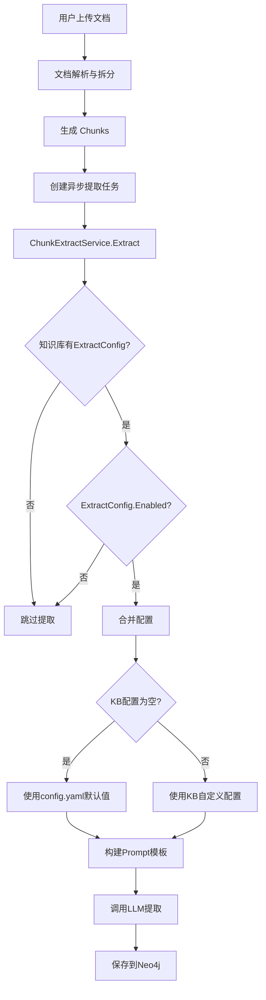
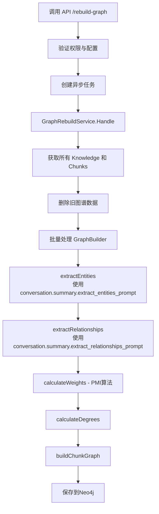

# WeKnora 知识图谱配置系统说明

## 文档概述

本文档详细说明了 WeKnora 系统中知识图谱配置的工作机制、配置层级关系，以及配置验证逻辑的优化方案。

**创建时间**：2025-12-31  
**版本**：v2.0

---

## 目录

1. [配置体系架构](#一配置体系架构)
2. [配置层级关系](#二配置层级关系)
3. [工作流程详解](#三工作流程详解)
4. [配置优先级](#四配置优先级)
5. [问题修复记录](#五问题修复记录)
6. [使用指南](#六使用指南)

---

## 一、配置体系架构

### 1.1 两套独立的提取系统

WeKnora 知识图谱构建使用了两套独立的提取系统，分别服务于不同的应用场景：

#### **A. 实时增量提取（ChunkExtractService）**

- **用途**：处理新上传的文档
- **触发时机**：文档上传并拆分成 chunks 后自动执行
- **配置来源**：
  - 知识库级别的 `ExtractConfig`（存储在数据库 `knowledge_bases.extract_config` 字段）
  - 模板来自 `config.yaml` 的 `extract.extract_graph.description`
- **实现文件**：`internal/application/service/extract.go`
- **特点**：每个 chunk 独立提取，支持增量更新

#### **B. 批量重建（GraphBuilder）**

- **用途**：对已有文档批量重建知识图谱
- **触发时机**：手动调用 API `/api/v1/knowledge-bases/:id/rebuild-graph`
- **配置来源**：
  - 全局配置 `config.yaml` 的 `conversation.summary` 部分
  - `extract_entities_prompt`：实体提取提示词
  - `extract_relationships_prompt`：关系提取提示词
- **实现文件**：`internal/application/service/graph.go`
- **特点**：批量处理，使用全局优化算法（PMI权重、度分析、chunk图）

---

### 1.2 配置文件结构

#### **config.yaml 配置结构**

```yaml
# 用于批量重建（GraphBuilder）
conversation:
  summary:
    extract_entities_prompt: |
      ## 角色
      你是一位顶级的中国法律领域知识图谱构建专家...
      
    extract_relationships_prompt: |
      ## 角色
      你是一位顶级的中国法律领域知识图谱构建专家...

# 用于实时增量提取（ChunkExtractService）
extract:
  extract_graph:
    description: |
      请基于给定文本，按以下步骤完成信息提取任务...
    tags:
      - "属于"
      - "引用"
      - "适用"
      # ... 70+ 个法律关系类型
    examples:
      - text: "判决书示例文本..."
        node:
          - name: "案号"
            attributes: ["描述"]
        relation:
          - node1: "判决书"
            node2: "法条"
            type: "引用"
```

#### **数据库配置结构**

```go
// knowledge_bases 表
type KnowledgeBase struct {
    ID            string
    Name          string
    ExtractConfig *ExtractConfig  // JSON 字段
    // ... 其他字段
}

type ExtractConfig struct {
    Enabled   bool             // 是否启用知识图谱提取
    Text      string           // 示例文本
    Tags      []string         // 关系类型列表
    Nodes     []*GraphNode     // 示例节点
    Relations []*GraphRelation // 示例关系
}
```

---

## 二、配置层级关系

### 2.1 前端配置界面

前端"知识库设置 > 知识图谱配置"界面提供以下配置项：

```
┌─────────────────────────────────────┐
│ 知识图谱配置                          │
├─────────────────────────────────────┤
│ ☑ 启用实体关系提取                   │
│                                     │
│ 关系类型：[作者, 别名]                │
│                                     │
│ 示例文本：[生成随机文本]              │
│                                     │
│         [保存配置]                   │
└─────────────────────────────────────┘
```

这些配置会被保存到数据库的 `knowledge_bases.extract_config` 字段。

### 2.2 config.yaml 默认配置

`config.yaml` 中的 `extract.extract_graph` 配置作为**默认值**和**模板**：

| 配置项 | 作用 | 是否可被覆盖 |
|--------|------|-------------|
| `description` | 提取任务描述模板 | ❌ 不可覆盖，所有知识库共用 |
| `tags` | 默认关系类型列表 | ✅ 可被前端配置覆盖 |
| `examples` | 默认示例数据 | ✅ 可被前端配置覆盖 |

---

## 三、工作流程详解

### 3.1 实时提取工作流程



### 3.2 配置合并逻辑（关键代码）

```go
// internal/application/service/extract.go

// 合并知识库配置与默认配置
template := &types.PromptTemplateStructured{
    Description: s.template.Description, // 始终使用 config.yaml 的描述
    Tags:        kb.ExtractConfig.Tags,
    Examples:    make([]types.GraphData, 0),
}

// 如果 KB 配置为空，使用默认 tags
if len(template.Tags) == 0 {
    template.Tags = s.template.Tags
    logger.Debugf(ctx, "Using default tags from config.yaml: %d tags", len(template.Tags))
}

// 如果 KB 配置为空，使用默认 examples
if kb.ExtractConfig.Text != "" || len(kb.ExtractConfig.Nodes) > 0 || len(kb.ExtractConfig.Relations) > 0 {
    // KB 有自定义示例配置
    template.Examples = []types.GraphData{
        {
            Text:     kb.ExtractConfig.Text,
            Node:     kb.ExtractConfig.Nodes,
            Relation: kb.ExtractConfig.Relations,
        },
    }
} else if len(s.template.Examples) > 0 {
    // 使用 config.yaml 的默认示例
    template.Examples = s.template.Examples
}
```

### 3.3 批量重建工作流程



**注意**：批量重建**不读取**知识库的 `ExtractConfig`，完全使用 `config.yaml` 全局配置。

---

## 四、配置优先级

### 4.1 实时提取配置优先级

```
知识库 ExtractConfig (数据库) > config.yaml 默认配置
```

具体规则：

| 配置项 | 优先级规则 |
|--------|-----------|
| `Description` | 始终使用 `config.yaml` 的模板 |
| `Tags` | KB有配置 → 用KB配置<br/>KB无配置 → 用 config.yaml |
| `Examples` | KB有配置 → 用KB配置<br/>KB无配置 → 用 config.yaml |

### 4.2 批量重建配置优先级

```
config.yaml conversation.summary (唯一来源)
```

批量重建不受知识库级别配置影响。

---

## 五、问题修复记录

### 5.1 问题描述

**问题现象**：  
在前端"知识图谱配置"页面，仅勾选"启用实体关系提取"而不填写其他字段时，系统返回错误：

```
text cannot be empty
tags cannot be empty
nodes cannot be empty
relations cannot be empty
```

**问题原因**：  
验证逻辑强制要求所有字段必填，不符合"允许使用默认值"的设计理念。

### 5.2 修复方案

#### **修复文件 1：internal/handler/knowledgebase.go**

**修改前**（Line 508-571）：
```go
func validateExtractConfig(config *types.ExtractConfig) error {
    if config.Text == "" {
        return errors.NewBadRequestError("text cannot be empty")
    }
    if len(config.Tags) == 0 {
        return errors.NewBadRequestError("tags cannot be empty")
    }
    // ... 强制要求所有字段
}
```

**修改后**：
```go
func validateExtractConfig(config *types.ExtractConfig) error {
    // When enabled is true, allow empty fields to use default values from config.yaml
    // Only validate non-empty fields for data integrity
    
    // 只验证已提供字段的数据完整性
    for i, tag := range config.Tags {
        if tag == "" {
            return errors.NewBadRequestError("tag cannot be empty at index " + strconv.Itoa(i))
        }
    }
    // ... 其他验证逻辑
}
```

#### **修复文件 2：internal/application/service/extract.go**

**修改前**（Line 100-123）：
```go
template := &types.PromptTemplateStructured{
    Description: s.template.Description,
    Tags:        kb.ExtractConfig.Tags,
    Examples: []types.GraphData{
        {
            Text:     kb.ExtractConfig.Text,
            Node:     kb.ExtractConfig.Nodes,
            Relation: kb.ExtractConfig.Relations,
        },
    },
}
```

**修改后**：
```go
// 新增默认值合并逻辑
if len(template.Tags) == 0 {
    template.Tags = s.template.Tags
    logger.Debugf(ctx, "Using default tags from config.yaml")
}

if kb.ExtractConfig.Text != "" || len(kb.ExtractConfig.Nodes) > 0 {
    // 使用 KB 自定义配置
} else if len(s.template.Examples) > 0 {
    // 使用 config.yaml 默认配置
    template.Examples = s.template.Examples
}
```

#### **修复文件 3：internal/handler/initialization.go**

同样修改了系统初始化时的验证逻辑，允许使用默认配置。

### 5.3 验证结果

✅ 编译通过：`go build -o tmp/test_build ./cmd/server`  
✅ 逻辑验证：允许字段为空，自动使用默认值  
✅ 向下兼容：原有填写完整配置的方式仍然有效

---

## 六、使用指南

### 6.1 前端配置方式

#### **方式 1：完全使用默认配置（推荐）**

1. 进入"知识库设置 > 知识图谱配置"
2. 仅勾选"☑ 启用实体关系提取"
3. 其他字段保持为空
4. 点击"保存配置"

**效果**：
- 关系类型：使用 config.yaml 中的 70+ 个法律关系类型
- 示例：使用 config.yaml 中的法律判决书示例

#### **方式 2：部分自定义配置**

1. 勾选"☑ 启用实体关系提取"
2. 只填写需要自定义的字段：
   - 例如：只自定义关系类型为 `["作者", "别名"]`
   - 示例部分留空
3. 点击"保存配置"

**效果**：
- 关系类型：使用你的自定义配置
- 示例：使用 config.yaml 的默认示例

#### **方式 3：完全自定义配置**

1. 勾选"☑ 启用实体关系提取"
2. 填写所有字段：
   - 关系类型
   - 示例文本
   - 生成实体和关系
3. 点击"保存配置"

**效果**：
- 完全使用你的自定义配置

### 6.2 配置调试建议

#### **查看实际使用的配置**

在日志中搜索以下关键字：

```bash
# 查看是否使用了默认配置
grep "Using default tags from config.yaml" logs/app.log
grep "Using default examples from config.yaml" logs/app.log

# 查看是否使用了自定义配置
grep "Using custom example from knowledge base config" logs/app.log
```

#### **配置生效验证**

1. 上传测试文档到配置了知识图谱的知识库
2. 查看 Neo4j 中生成的节点和关系类型
3. 验证是否符合预期

### 6.3 常见问题 FAQ

#### **Q1：前端只勾选启用，不填任何配置，能正常工作吗？**

✅ **能**。系统会自动使用 config.yaml 中的默认配置。

#### **Q2：默认配置在哪里查看？**

📄 文件路径：`config/config.yaml`  
📍 配置位置：`extract.extract_graph` 节点

#### **Q3：如何知道当前使用的是默认配置还是自定义配置？**

查看应用日志，搜索关键字：
- `Using default tags from config.yaml` - 使用默认 tags
- `Using custom example from knowledge base config` - 使用自定义配置

#### **Q4：批量重建功能使用什么配置？**

批量重建功能固定使用 `config.yaml` 的 `conversation.summary` 配置，**不受知识库级别配置影响**。

#### **Q5：如何统一所有知识库的配置？**

- **实时提取**：在所有知识库中都使用默认配置（不填写自定义配置）
- **批量重建**：修改 `config.yaml` 的 `conversation.summary` 部分

#### **Q6：法律领域的默认配置包含哪些内容？**

- **关系类型**：70+ 个，涵盖 16 大类：
  - 法规体系内关系、司法解释、判决书引用、案例指导
  - 立法解释、国际条约、仲裁、行政执法、检察监督等
- **实体类型**：45+ 个，包括：
  - 12 大文档类型、法规结构、案件标识、法律要素等
- **示例**：完整的刑事判决书案例

---

## 七、配置文件示例

### 7.1 config.yaml 关键配置段

```yaml
extract:
  extract_graph:
    description: |
      请基于给定文本，按以下步骤完成信息提取任务，确保逻辑清晰、信息完整准确：

      ## 特别说明：中国法律知识图谱统一抽取
      本任务面向12大法律文档源...
      
    tags:
      # 一、法规体系内关系
      - "属于"
      - "组成部分"
      - "修订"
      
      # 二、司法解释与法规关系
      - "解释"
      - "澄清"
      
      # 三、判决书与法规关系
      - "引用"
      - "适用"
      - "参照"
      
      # ... 更多关系类型
      
    examples:
      - text: |
          北京市第一中级人民法院刑事判决书 (2023)京01刑初123号...
        node:
          - name: "(2023)京01刑初123号"
            attributes:
              - "北京市第一中级人民法院刑事判决书案号"
          - name: "张三"
            attributes:
              - "被告人，男，1985年5月1日出生"
        relation:
          - node1: "张三"
            node2: "盗窃罪"
            type: "被指控"
```

### 7.2 数据库 ExtractConfig 示例

#### **完全使用默认配置**

```json
{
  "enabled": true,
  "text": "",
  "tags": [],
  "nodes": [],
  "relations": []
}
```

#### **自定义关系类型**

```json
{
  "enabled": true,
  "text": "",
  "tags": ["作者", "别名", "创作"],
  "nodes": [],
  "relations": []
}
```

#### **完全自定义配置**

```json
{
  "enabled": true,
  "text": "红楼梦是清代作家曹雪芹创作的长篇小说...",
  "tags": ["作者", "别名", "创作"],
  "nodes": [
    {
      "name": "曹雪芹",
      "attributes": ["清代作家"]
    },
    {
      "name": "红楼梦",
      "attributes": ["长篇小说"]
    }
  ],
  "relations": [
    {
      "node1": "曹雪芹",
      "node2": "红楼梦",
      "type": "创作"
    }
  ]
}
```

---

## 八、技术架构图

### 8.1 配置流转图

```
┌─────────────────────────────────────────────────────────────┐
│                        config.yaml                          │
├────────────────────┬────────────────────────────────────────┤
│ extract.           │ conversation.summary.                  │
│ extract_graph      │ extract_entities_prompt                │
│  - description     │ extract_relationships_prompt           │
│  - tags (默认)     │                                        │
│  - examples (默认) │                                        │
└────────────────────┴────────────────────────────────────────┘
         │                              │
         │                              │
         ▼                              ▼
┌──────────────────────┐      ┌────────────────────────┐
│ ChunkExtractService  │      │    GraphBuilder        │
│  (实时增量提取)        │      │   (批量重建)            │
└──────────────────────┘      └────────────────────────┘
         │                              │
         │                              │
         ▼                              │
┌──────────────────────┐              │
│  KB.ExtractConfig    │              │
│   (数据库配置)        │              │
│   可覆盖默认值        │              │
└──────────────────────┘              │
         │                              │
         └──────────┬───────────────────┘
                    │
                    ▼
         ┌────────────────────┐
         │      Neo4j         │
         │   知识图谱存储      │
         └────────────────────┘
```

### 8.2 代码调用链

```
实时提取流程：
Document Upload
  → ChunkService.CreateChunk()
    → NewChunkExtractTask()
      → ChunkExtractService.Extract()
        → 读取 KB.ExtractConfig
        → 合并 config.yaml 默认值
        → chatpipline.Extractor.Extract()
          → LLM 提取
            → graphEngine.AddGraph()
              → Neo4j 存储

批量重建流程：
API: POST /rebuild-graph
  → GraphRebuildService.RebuildGraphAsync()
    → asynq.Task(TypeGraphRebuild)
      → GraphRebuildService.Handle()
        → GraphBuilder.BuildGraph()
          → extractEntities()
            → 使用 config.Conversation.ExtractEntitiesPrompt
          → extractRelationships()
            → 使用 config.Conversation.ExtractRelationshipsPrompt
          → calculateWeights()
          → graphEngine.AddGraph()
```

---

## 九、未来优化建议

### 9.1 短期优化

1. **批量重建支持 KB 配置**
   - 建议修改 GraphBuilder 也读取知识库的 ExtractConfig
   - 保持实时提取与批量重建的配置一致性

2. **前端配置预览**
   - 在前端显示当前将使用的实际配置（包括默认值）
   - 帮助用户理解配置合并结果

3. **配置模板管理**
   - 允许管理员保存多套配置模板
   - 在创建知识库时选择模板

### 9.2 长期优化

1. **自适应配置**
   - 根据文档类型自动推荐合适的关系类型
   - 使用机器学习优化提取效果

2. **配置版本控制**
   - 记录配置变更历史
   - 支持配置回滚

3. **多领域支持**
   - 除法律领域外，扩展到医疗、金融等领域
   - 提供领域配置包

---

## 十、参考资料

### 10.1 相关文档

- [知识图谱批量重建功能说明.md](./知识图谱批量重建功能说明.md)
- [MCP功能使用说明.md](./MCP功能使用说明.md)
- [开发指南.md](./开发指南.md)

### 10.2 关键代码文件

- `internal/application/service/extract.go` - 实时提取服务
- `internal/application/service/graph.go` - 批量重建服务
- `internal/application/service/graph_rebuild.go` - 批量重建任务处理
- `internal/handler/knowledgebase.go` - 知识库 API 处理
- `internal/types/knowledgebase.go` - 数据结构定义
- `internal/types/extract_graph.go` - 提取相关类型定义
- `internal/config/config.go` - 配置结构定义
- `config/config.yaml` - 配置文件

### 10.3 数据库表结构

```sql
-- knowledge_bases 表
CREATE TABLE knowledge_bases (
    id VARCHAR(36) PRIMARY KEY,
    name VARCHAR(255),
    extract_config JSON,  -- ExtractConfig 配置
    -- ... 其他字段
);
```

---

## 附录：修改清单

| 文件 | 修改内容 | 行号 |
|------|---------|------|
| `internal/handler/knowledgebase.go` | 修改 `validateExtractConfig` 函数，允许字段为空 | 508-571 |
| `internal/application/service/extract.go` | 添加默认值合并逻辑 | 100-145 |
| `internal/handler/initialization.go` | 修改 `validateNodeExtractConfig` 函数 | 534-553 |
| `config/config.yaml` | 已更新法律领域示例（之前的修改） | 552-683 |

---

**文档维护**：本文档会随着系统迭代持续更新  
**问题反馈**：如有疑问或建议，请提交 Issue 或联系开发团队
